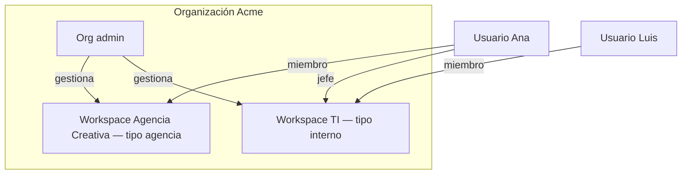
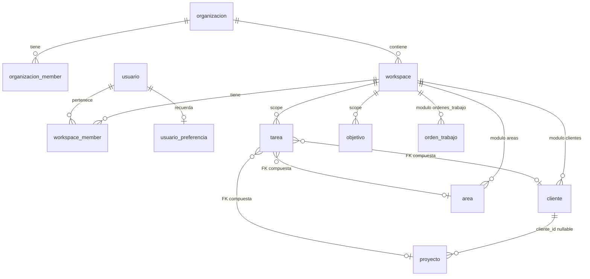

# Materen V5 — Multi-organización y multi-workspace

**Producto:** Materen SGTD  
**Estado:** **V5 core completo** — migraciones 043–050; panel del dueño operativo en Dev
**Última actualización:** 2026-06-10 (043–050 Dev ✅)
**Predecesor:** V4 (equipo único implícito, rol global en `usuario.rol`)  
**Documentos relacionados:** [CONTEXT.md](./CONTEXT.md) · [TAREA-MODEL.md](./TAREA-MODEL.md) · `.cursor/rules/sgtd-rbac.mdc` · `auditorias/auditoria_18052026.md` (B-03 multi-tenant)

---

## 1. Resumen ejecutivo

Materen **V5** introduce tres capas de contexto:

```
Organización  →  Workspace  →  Datos operativos
     │               │
     │               └── tipo: interno | agencia
     └── admin de org, invitaciones, catálogos compartidos opcionales
```

**Principio rector:** un solo producto, una sola SPA, **UI adaptativa** según el tipo de workspace activo. No dos aplicaciones paralelas.

**Principio de seguridad:** el aislamiento entre workspaces es **RLS en Postgres**; la UI solo oculta módulos. Un bug de frontend no puede ser la única barrera.

**Continuidad con V4:** el modelo de tarea v1.1 (dos ejes), logs con justificación, incidencias, objetivos, Mi Semana, OT formal, métricas y planificación **se mantienen** dentro del workspace activo.

---

## 2. Jerarquía y definiciones

| Concepto | Definición |
|----------|------------|
| **Organización** | Empresa o entidad legal que contrata Materen. Contiene uno o más workspaces. |
| **Workspace** | Unidad operativa aislada: un equipo interno, una agencia, un departamento. Todos los datos de negocio pertenecen a un workspace. |
| **Usuario** | Identidad global (`auth.users` + fila en `usuario`). Puede pertenecer a varios workspaces con **roles distintos** en cada uno. |
| **Membresía** | Relación `(usuario, workspace, rol)`. Fuente de verdad del RBAC operativo. |
| **Contexto activo** | Par `(organizacion_id, workspace_id)` seleccionado en sesión; determina queries, RLS y menú. |



---

## 3. Roles (cuatro niveles)

V4 tenía `jefe | miembro` **global** en `usuario.rol`. V5 **elimina el rol global como fuente de verdad** y lo traslada a `workspace_member`.

### Nivel 0 — Dueño de plataforma (superadmin)

Nivel **por encima de las organizaciones**. Registrado en la tabla `plataforma_owner`.

- **Único** que puede crear organizaciones (gate en `sgtd_crear_organizacion`, migr. 047).
- Ve y opera **cualquier** organización sin ser miembro (bypass de acceso, migr. 048).
- Gestiona usuarios: lista todos y los asigna a organizaciones (049).
- Gestiona módulos de cualquier organización desde el panel (050).

**NO bypasea:** auto-asignación de dueño (`plataforma_owner`), escalada de `usuario.rol`, ni la whitelist de dominios (`sgtd_config`).

El dueño opera **una organización a la vez**: elige una en el panel o entra a una org → eso fija el header `x-workspace-id` → actúa como jefe de ese workspace (048).

### Niveles 1–3 — Dentro de una organización

| Rol | Código | Alcance | Responsabilidades |
|-----|--------|---------|-------------------|
| **Admin de organización** | `org_admin` | Toda la organización | Crear/editar workspaces, **crear usuarios**, asignar membresías; **sin acceso a datos operativos** sin membresía en workspace (D7) |
| **Jefe de workspace** | `jefe` | Un workspace | Supervisar equipo, planificación, métricas, logs, CRUD según módulos activos |
| **Miembro de workspace** | `miembro` | Un workspace | Ejecutar tareas asignadas, incidencias, objetivos propios |

### Reglas

1. **Org admin ≠ jefe automático.** Operar el día a día requiere membresía `jefe` en el workspace concreto. **Org admin sin membresía no ve tareas ni OT** (`sgtd_puede_acceder_workspace` → false) — D7.
2. **Un usuario puede ser `jefe` en un workspace y `miembro` en otro** sin conflicto — cada workspace es un mundo aislado.
3. **RLS siempre consulta la membresía del workspace activo**, no claims JWT ni `localStorage` sin validar en BD.
4. **`sgtd_es_jefe()`** (V5): `EXISTS (membresía activa WHERE workspace_id = sgtd_workspace_id() AND rol = 'jefe')`.

---

## 4. Tipos de workspace

Un workspace tiene **exactamente un tipo**, fijado al crear (cambio de tipo post-creación: **no permitido** en V5.0 — evita migraciones de datos ambiguas).

| Tipo | Código | Perfil | Módulos base | Extensiones |
|------|--------|--------|--------------|-------------|
| **Interno** | `interno` | Equipo departamental (TI, ops, backoffice) | Mi Semana, Objetivos, OT, Métricas, Planificación | Sin cliente / proyecto / área |
| **Agencia** | `agencia` | Estudio, consultora, agencia de servicios | Igual que interno | **Cliente**, **Proyecto**, **Área** en tareas + filtros |

### Implementación UI (no dos apps)

- Misma shell (`AppShell`), mismas rutas base.
- Campos y filtros de agencia **ocultos o disabled** en workspace `interno`.
- En `agencia`, formulario de tarea incluye contexto comercial; Mi Semana sigue siendo el eje diario.
- Validación en **RPC** (no solo UI): en `interno`, `cliente_id`, `proyecto_id`, `area_id` deben ser `NULL`.

---

## 5. Flujos de usuario

### 5.1 Admin de organización (bootstrap)

Orden obligatorio de configuración:

1. **Crear organización** (nombre, slug único).
2. **Crear workspaces** — nombre, tipo (`interno` | `agencia`).
3. Si tipo `agencia`: **definir áreas** (catálogo por workspace, p. ej. Diseño, Dev, QA).
4. **Crear clientes y proyectos** (solo workspaces `agencia`; proyectos ligados a cliente).
5. **Crear usuarios** (email) — solo org admin (D5).
6. **Jefe asigna** usuarios existentes a su workspace con rol (D5).
7. Usuario invitado recibe correo → contraseña temporal → primer acceso (`workspace_member.joined_at` NULL = pendiente).

> **Migración V4:** el entorno actual se backfilleará como 1 org + 1 workspace `interno` + membresías equivalentes a `usuario.rol` actual.

### 5.2 Primer acceso del usuario

```
Login (invitación o credenciales)
  → Cambio de contraseña temporal (si aplica)
  → ¿Cuántas organizaciones?  [1 → auto] [N → selector org]
  → ¿Cuántos workspaces en org? [1 → auto] [N → selector workspace]
  → Persistir último contexto (org_id, workspace_id)
  → Cargar membresía → rol efectivo → app
```

**Re-login:** ir al **último workspace** usado si la membresía sigue activa. Selectores solo si hay ambigüedad.

### 5.3 Switcher de workspace

- Ubicación: menú principal del shell (junto a navegación).
- Cambiar workspace = **cambio de contexto mental y técnico**:
  - Invalidar caché TanStack Query (`queryClient.clear()` o prefijo `[workspaceId]`).
  - Resetear estado UI de vista (`vistaStore`, filtros locales).
  - Recalcular permisos desde membresía activa.
  - Adaptar menú y campos al `workspace.tipo`.
- **Selector de organización:** solo visible si el usuario pertenece a **>1 org** (consultores, holdings). Mayoría de usuarios solo verá switcher de workspace.

---

## 6. Operación por tipo de workspace

### 6.1 Modo interno (`interno`)

Equivalente al **SGTD V4** actual.

**Jefe**

| Capacidad | Vista / módulo V4 |
|-----------|-------------------|
| Propias tareas + equipo | Mi Semana + selector miembro |
| Carga semanal del equipo | Planificación (solo lectura) |
| KPIs comparativos | Métricas |
| Crear y asignar tareas | Modal Mi Semana, detalle |
| Historial con motivos | Log de acciones |
| OT formal | Órdenes de trabajo |

**Miembro**

| Capacidad | Vista / módulo V4 |
|-----------|-------------------|
| Solo tareas asignadas (edición) | Mi Semana |
| Ver tareas del equipo (lectura) | Mi Semana (RLS + UI) |
| Incidencias del día | Columna HOY |
| Objetivos propios | Objetivos |

**Campos de tarea (interno):** título, descripción, prioridad, asignado, fecha planificada, objetivo opcional. Sin cliente / proyecto / área.

### 6.2 Modo agencia (`agencia`)

Misma base operativa + **contexto comercial**.

**Jefe**

- Mi Semana y Planificación con filtros por **área**, **proyecto**, **cliente**.
- Crear tarea con: título, descripción, prioridad, **cliente**, **proyecto**, **área**, asignado.
- Métricas y logs **scoped al workspace** (no cruzan clientes de otro ws).

**Miembro**

- Ve sus tareas con contexto legible: «Proyecto X · Cliente Y · Área Diseño».
- Avanza, completa, cancela con motivo — sin acceso a administración de catálogos.

**Entidades agencia (siempre con `workspace_id`):**

| Entidad | Notas |
|---------|-------|
| `cliente` | Catálogo por workspace |
| `proyecto` | `cliente_id` nullable (proyectos internos); estado activo/completado/archivado |
| `area` | Catálogo por workspace; crean **org admin o jefe** del ws (D4) |

---

## 7. Lo que no cambia en V5

| Dominio | Regla |
|---------|-------|
| **Tarea v1.1** | Dos ejes: `estado` (4 valores) + `situacion` (vista `tarea_activa`). Ver [TAREA-MODEL.md](./TAREA-MODEL.md). |
| **Reprogramar / cancelar / eliminar** | Justificación ≥10 caracteres + RPC atómica + log |
| **Incidencias** | `tipo=no_planificada`, `es_imprevisto=true`, `estado=completada` |
| **Objetivos** | Progreso = completadas / total no canceladas; scoped por workspace |
| **OT (solo interno)** | Flujo 4 estados, número al enviar por workspace, receptor + DNI. **No en agencia** (D2). Ver `sgtd-ot.mdc`. |
| **Enums** | `estado_tarea`, `tipo_tarea`, `prioridad_tarea` sin cambio |
| **Vista `tarea_activa`** | Recrear con `workspace_id`, `cliente_id`, `proyecto_id`, `area_id` |
| **RPCs `sgtd_*`** | Se extienden con contexto workspace; no reescritura desde cero |
| **Planificación** | Solo jefe; solo lectura |
| **Métricas** | Solo jefe; ponderación por prioridad |
| **Design system** | Materen Canvas — sin cambio de principios |

---

## 8. Schema final (V5)

### Capa 1 — Organización y workspaces

**`organizacion`** — empresa o entidad contenedora.

| Columna | Tipo | Notas |
|---------|------|-------|
| `id` | uuid PK | |
| `nombre` | text NOT NULL | |
| `slug` | text NOT NULL UNIQUE | |
| `activa` | boolean DEFAULT true | |
| `created_at` | timestamptz | |

**`organizacion_member`** — quién administra la org.

| Columna | Tipo | Notas |
|---------|------|-------|
| `id` | uuid PK | |
| `organizacion_id` | uuid FK → organizacion | |
| `usuario_id` | uuid FK → usuario | |
| `rol` | text CHECK `org_admin` | |
| `activo` | boolean DEFAULT true | |
| `joined_at` | timestamptz | |
| — | UNIQUE `(organizacion_id, usuario_id)` | |

**`workspace`** — unidad operativa; tipo **inmutable** (D6).

| Columna | Tipo | Notas |
|---------|------|-------|
| `id` | uuid PK | |
| `organizacion_id` | uuid FK → organizacion | |
| `nombre` | text NOT NULL | |
| `tipo` | text CHECK `interno` \| `agencia` | |
| `activo` | boolean DEFAULT true | |
| `created_at` | timestamptz | |

**`workspace_member`** — **fuente de verdad del RBAC operativo**.

| Columna | Tipo | Notas |
|---------|------|-------|
| `id` | uuid PK | |
| `workspace_id` | uuid FK → workspace | |
| `usuario_id` | uuid FK → usuario | |
| `rol` | text CHECK `jefe` \| `miembro` | |
| `activo` | boolean DEFAULT true | |
| `invited_at` | timestamptz | |
| `joined_at` | timestamptz NULL | **NULL = pendiente; NOT NULL = activo** |
| — | UNIQUE `(workspace_id, usuario_id)` | |

### Capa 2 — Usuario

**`usuario`** — identidad global; **sin rol operativo**.

| Columna | Tipo | Notas |
|---------|------|-------|
| `id` | uuid PK | = `auth.uid()` |
| `email` | text NOT NULL UNIQUE | |
| `nombre` | text NOT NULL | |
| `avatar_url` | text NULL | |
| `activo` | boolean DEFAULT true | Baja global; impide login |
| `created_at` | timestamptz | |
| `updated_at` | timestamptz | |
| `rol` | — | **DEPRECATED** → eliminar en migración **046** (pendiente) tras backfill |

**`usuario_preferencia`** — último contexto.

| Columna | Tipo | Notas |
|---------|------|-------|
| `usuario_id` | uuid PK FK → usuario | |
| `ultima_org_id` | uuid NULL FK → organizacion | |
| `ultima_workspace_id` | uuid NULL FK → workspace | |
| `updated_at` | timestamptz | |

RPC valida que `ultima_workspace_id` siga siendo membresía activa; si no, muestra picker.

### Capa 1b — Módulos por workspace (044, libres desde 045)

**`workspace_modulo`** — features de dominio activables por workspace.

| Columna | Tipo | Notas |
|---------|------|-------|
| `workspace_id` | uuid FK → workspace | PK compuesta con `modulo` |
| `modulo` | text | Catálogo fijo (ver §11) |
| `activo` | boolean | `false` = ocultar UI; datos conservados |
| `activado_en`, `updated_at` | timestamptz | |

**RPCs:** `sgtd_crear_organizacion` (bootstrap org+ws+módulos, cualquier combinación del catálogo), `sgtd_workspace_tiene_modulo`.

**Enforcement (045/047):** trigger `workspace_modulo_validar` — solo **`bitacora`** no desactivable (+ `updated_at`). **Sin** validación módulo↔`workspace.tipo`. `workspace.tipo` = etiqueta informativa (`interno`/`agencia`).

### Capa 3 — Catálogos cliente / proyecto / área

Disponibles cuando el módulo correspondiente está activo en `workspace_modulo` (RLS vía `sgtd_workspace_tiene_modulo`). **FK compuesta** `(workspace_id, id)` en catálogos para integridad cross-workspace.

**`cliente`**

| Columna | Constraints |
|---------|-------------|
| `id`, `workspace_id` NOT NULL FK, `nombre` NOT NULL, `activo`, `created_at` | UNIQUE `(workspace_id, id)` · UNIQUE `(workspace_id, lower(nombre))` |

**`proyecto`**

| Columna | Constraints |
|---------|-------------|
| `id`, `workspace_id` NOT NULL FK, `cliente_id` NULL FK → cliente, `nombre` NOT NULL, `descripcion` NULL, `estado` CHECK `activo`\|`completado`\|`archivado`, `created_at` | UNIQUE `(workspace_id, id)` |

Regla: si `cliente_id NOT NULL`, el cliente debe pertenecer al mismo `workspace_id` (RPC + trigger).

**`area`** — crean org admin o jefe del workspace (D4).

| Columna | Constraints |
|---------|-------------|
| `id`, `workspace_id` NOT NULL FK, `nombre` NOT NULL, `activo`, `created_at` | UNIQUE `(workspace_id, id)` · UNIQUE `(workspace_id, lower(nombre))` |

### Capa 4 — Datos operativos

Todas reciben **`workspace_id uuid NOT NULL FK → workspace`** + índice `idx_*_workspace_id`.

| Tabla | Notas V5 |
|-------|----------|
| `tarea` | + FKs catálogo compuestas; trigger coherencia FK por workspace |
| `objetivo` | |
| `evento` | |
| `recurrencia_evento` | Antes omitida; obligatoria en V5 |
| `nota_bitacora` | |
| `log_accion` | Denormalizar `workspace_id` en INSERT vía RPC |
| `orden_trabajo` | Requiere módulo `ordenes_trabajo` activo (045) |
| `tipo_trabajo_ot` | Asociado a OT por workspace |
| `log_ot` | Asociado a OT por workspace |

**No incluir:** `configuracion_semana` — eliminada en migración **011**.

**Columnas agencia en `tarea`:**

```text
cliente_id   uuid NULL  FK → cliente (workspace_id, id)
proyecto_id  uuid NULL  FK → proyecto (workspace_id, id)
area_id      uuid NULL  FK → area (workspace_id, id)
```

**Triggers `BEFORE INSERT/UPDATE` en `tarea` (045):**

- Si `cliente_id` / `proyecto_id` / `area_id` NOT NULL → deben pertenecer al mismo `workspace_id` que la tarea (`tarea_agencia_integridad`).
- Ya **no** se fuerza NULL por `workspace.tipo`.

**OT — correlativo por workspace:**

- `UNIQUE (workspace_id, numero)` en `orden_trabajo`.
- `sgtd_generar_numero_ot(p_workspace_id)` reemplaza el global `generar_numero_ot()`.
- RLS OT: módulo `ordenes_trabajo` activo (`sgtd_workspace_tiene_modulo`).

**Vista `tarea_activa`:** recrear incluyendo `workspace_id`, `cliente_id`, `proyecto_id`, `area_id`.

### Capa 5 — Relaciones finales

```text
organizacion
  └→ organizacion_member  (org_admin)
  └→ workspace
       └→ workspace_member  (jefe | miembro)
       └→ tarea, objetivo, evento, recurrencia_evento
       └→ nota_bitacora, log_accion
       └→ orden_trabajo, tipo_trabajo_ot, log_ot   (módulo ordenes_trabajo)
       └→ cliente     (módulo clientes)
            └→ proyecto  (cliente_id nullable — D3)
       └→ area         (módulo areas)

usuario
  └→ organizacion_member  (una o varias orgs — D1)
  └→ workspace_member     (uno o varios workspaces)
  └→ usuario_preferencia
```

### Diagrama ER



---

## 9. Contexto de sesión y RLS

### 9.1 Workspace activo

El workspace activo debe estar disponible en **cada petición autenticada** a Postgres. Opciones (elegir una en implementación):

| Opción | Mecanismo | Pros / contras |
|--------|-----------|----------------|
| **A** | Header `X-Workspace-Id` + función `sgtd_workspace_id()` lee setting de sesión | Explícito; fácil de auditar |
| **B** | Tabla `sesion_contexto(usuario_id, workspace_id)` actualizada al switch | Sin header custom en SDK |
| **C** | Claim JWT custom post-login | Acoplado a auth; refresh complejo |

**Recomendación V5.0:** opción **A** o **B**; documentar en migración `043`.

### 9.2 Funciones RLS (V5 final)

| Función | Comportamiento |
|---------|----------------|
| `sgtd_workspace_id()` | Workspace activo de la sesión; filtro base de todo query/RPC |
| `sgtd_es_jefe()` | Membresía `jefe` activa (`joined_at NOT NULL`, `activo`) en workspace activo |
| `sgtd_es_miembro_activo()` | Membresía `jefe` o `miembro` activa en workspace activo |
| `sgtd_es_org_admin(org_id)` | Rol `org_admin` en esa organización |
| `sgtd_puede_acceder_workspace(ws_id)` | Membresía activa en ese workspace; **org_admin sin membresía → false** (D7) |

Reemplazo V4: `sgtd_es_jefe()` ya no lee `usuario.rol` global.

### 9.3 Patrón de política

Toda política `sgtd_*` en tablas de dominio incluye:

```sql
workspace_id = sgtd_workspace_id()
AND sgtd_puede_acceder_workspace(workspace_id)
```

**Tests obligatorios:** usuario A en workspace 1 **no** lee filas de workspace 2 (0 resultados, no error visible).

### 9.4 RPCs

- Todas las RPCs `sgtd_*` existentes inferen `workspace_id` del contexto activo en `INSERT`.
- Validar membresía antes de mutar.
- Correlativo OT: **`sgtd_generar_numero_ot(workspace_id)`** — secuencia por workspace (D2).
- RLS módulo OT: políticas condicionadas a `workspace.tipo = 'interno'`.

### 9.5 Realtime

V4: `equipo:{jefeId}`. V5: `workspace:{workspaceId}:eventos` (o subcanales por tipo de evento).

---

## 10. Frontend (cambios arquitectónicos)

### 10.1 Stores

| Store | V5 |
|-------|-----|
| `authStore` | Usuario global (id, email, nombre) — **sin rol operativo** |
| `workspaceStore` (nuevo) | `organizacionId`, `workspaceId`, `workspaceTipo`, `rol` efectivo |
| `vistaStore` | Se resetea al cambiar workspace |

### 10.2 Selectores

```typescript
selectEsJefe(state)      // rol === 'jefe' en workspace activo
selectWorkspaceTipo(state) // 'interno' | 'agencia'
selectEsOrgAdmin(state)  // org activa
```

Reemplazar lecturas de `authStore.usuario.rol` en guards (`JefeRoute`, condicionales UI).

### 10.3 TanStack Query

Prefijo obligatorio en `queryKey`:

```typescript
['ws', workspaceId, 'semana', semanaIso, uid]
```

Al switch: `queryClient.removeQueries({ queryKey: ['ws', oldId] })`.

### 10.4 Rutas nuevas (propuesta)

| Ruta | Propósito |
|------|-----------|
| `/onboarding/org` | Selector org (si >1) |
| `/onboarding/workspace` | Selector workspace (si >1 en org) |
| `/admin/org` | Panel org admin (V5.1+) |
| `/admin/workspace/:id` | Miembros, áreas, clientes (V5.1+) |

Rutas operativas V4 (`/semana`, `/objetivos`, …) **sin cambio de path**; scope implícito por workspace activo.

### 10.5 Invitaciones (D5)

1. **Org admin** crea usuarios (email) a nivel org.
2. **Jefe** asigna usuarios existentes al workspace (`workspace_member`, `joined_at` NULL hasta primer login).
3. Primer login completa `joined_at`.
4. `VITE_ALLOWED_EMAIL_DOMAINS` puede permanecer como capa adicional en prod.

---

## 11. Módulos por workspace

### Nav core (no en `workspace_modulo`)

| Ruta | Control |
|------|---------|
| `/semana` (Mi Semana) | Siempre activo — core del producto |
| `/planificacion` | Rol `jefe` en workspace activo |
| `/metricas` | Rol `jefe` en workspace activo |

### Módulos configurables (`workspace_modulo`)

Catálogo fijo (ampliar solo con nueva migración). **Desde 045:** cualquier workspace puede activar cualquier módulo; `workspace.tipo` no restringe.

| Clave `modulo` | Nav / feature | Notas |
|----------------|---------------|-------|
| `objetivos` | `/objetivos` | Opcional desde 047 |
| `bitacora` | Panel notas Mi Semana | Obligatorio — no desactivable |
| `ordenes_trabajo` | `/ordenes-trabajo`, OT | RLS exige módulo activo |
| `areas` | Catálogo áreas | RLS insert exige módulo activo |
| `proyectos` | Catálogo proyectos | RLS insert exige módulo activo |
| `clientes` | Catálogo clientes | RLS insert exige módulo activo |

**Backfill 044:** workspaces existentes conservan módulos según su `tipo` al momento del backfill. Para combinar módulos “mixtos” (ej. interno + clientes), activar filas en `workspace_modulo` manualmente o vía UI admin (futuro).

### Vista funcional (referencia UX)

| Módulo | Visible si | Notas |
|--------|------------|-------|
| Mi Semana | Siempre | Chips/filtros cliente·proyecto·área si catálogos activos |
| Planificación | Rol jefe | Filtros extra si catálogos activos |
| Objetivos | Módulo `objetivos` | Nav AppShell |
| OT | Módulo `ordenes_trabajo` | Nav AppShell |
| Métricas | Rol jefe | |
| Notas (drawer) | Módulo `bitacora` (siempre on) | Visibilidad sin cambio |
| Clientes / Proyectos / Áreas (admin) | Módulos respectivos | |

---

## 12. Decisiones cerradas ✅

| # | Decisión | Respuesta |
|---|----------|-----------|
| **D1** | Usuario en varias organizaciones | **Sí** |
| **D2** | OT en workspace agencia | **Supersedido por 045** — OT disponible si módulo `ordenes_trabajo` activo (independiente de `tipo`) |
| **D3** | `proyecto.cliente_id` | **NULL permitido** (proyectos internos) |
| **D4** | Quién crea áreas | **Org admin o jefe** del workspace |
| **D5** | Quién invita | **Admin crea usuarios**; **jefe asigna** al workspace |
| **D6** | Tipo de workspace mutable | **No** — inmutable al crear; **solo etiqueta** desde 045 (sin enforcement) |
| **D7** | Org admin ve datos operativos sin membresía | **No** — `sgtd_puede_acceder_workspace` exige membresía (salvo bypass dueño en 048) |

| ID | Decisión | Estado | Notas |
|----|----------|--------|-------|
| **D8** | **Módulos libres por organización.** El campo `workspace.tipo` (interno/agencia) ya NO restringe qué módulos se pueden activar. Cualquier organización puede activar cualquier módulo. `tipo` queda como etiqueta informativa. | ✅ 045 | Eliminó `sgtd_modulo_valido_para_tipo`. RLS de catálogos depende del módulo activo, no del tipo. |
| **D9** | **Solo `bitacora` es módulo obligatorio.** `objetivos` pasó de obligatorio a opcional. Toda organización tiene Notas (bitácora) sí o sí; lo demás es elegible. | ✅ 047 | Trigger `workspace_modulo_validar` solo protege `bitacora`. El formulario de crear org y la RPC reflejan esto. |
| **D10** | **Desactivar un módulo OCULTA, no borra.** Los datos persisten; reactivar los vuelve a mostrar. Ningún dato se borra en el sistema. | ✅ 044/047 | `workspace_modulo.activo = false` oculta en UI/nav; las filas de datos siguen en BD. |
| **D11** | **Solo el dueño de plataforma crea organizaciones.** (Por ahora; a futuro se podrá liberar agregando filas a `plataforma_owner`.) | ✅ 047 | Gate en RPC + política `organizacion_insert` reforzada. Tabla `plataforma_owner` + `sgtd_es_plataforma_owner()`. |
| **D12** | **Superadmin: el dueño ve y opera todas las organizaciones.** Bypass centralizado en funciones helper (no en las ~90 políticas). | ✅ 048 | `sgtd_puede_acceder_workspace`, `sgtd_es_jefe`, `sgtd_es_miembro_activo` + política `organizacion_select` ganan `OR es_plataforma_owner`. Mantiene `workspace_id = sgtd_workspace_id()` (opera por header). |
| **D13** | **Gestión de usuarios en 3 pasos.** (1) crear cuenta en panel InsForge; (2) el usuario entra una vez → queda en `public.usuario`; (3) el dueño lo asigna a UNA org con rol jefe/miembro desde el panel. | ✅ 049 | Modelo «entran primero, luego asignas». RPC `sgtd_asignar_usuario_a_organizacion` inserta solo en `workspace_member`. Edge Function «un clic» = mejora futura. |
| **D14** | **`organizacion_member` es solo para org_admin estructural; `workspace_member` lleva el rol operativo (jefe/miembro).** | ✅ 049 | `organizacion_member.rol` solo admite `org_admin`. El dueño no inserta org_admin al asignar jefe/miembro. |
| **D15** | **El dueño gestiona módulos por organización desde el panel.** Vía RPC que recibe `organizacion_id` y resuelve el workspace internamente (sin depender del header en modo panel). | ✅ 050 | `sgtd_set_modulo_organizacion` + `sgtd_listar_modulos_organizacion`. Protege `bitacora` (doble defensa con el trigger). |

> **Nota:** D8 supersede la parte de D2 que ligaba módulos al tipo. D6 sigue vigente (tipo es etiqueta), reforzado por D8.

---

## 13. Migración desde V4

### 13.1 Backfill (entorno existente)

1. Crear `organizacion` default (nombre configurable).
2. Crear `workspace` default `tipo = interno`.
3. Por cada fila `usuario`: crear `workspace_member` con rol = `usuario.rol` legacy.
4. `UPDATE` todas las tablas de dominio SET `workspace_id = workspace_default.id`.
5. Crear primer `organizacion_member` org_admin (usuario designado).
6. Validar RLS con smoke tests jefe + miembro.

### 13.2 Compatibilidad frontend

- Fase transitoria: si solo hay un workspace, **auto-seleccionar** y ocultar switcher.
- Deprecar `usuario.rol` en UI tras validar membresías.

### 13.3 Rollback

- Migración 043 debe ser **reversible en staging** antes de prod.
- Backup: ver `db/RUNBOOK-BACKUP-RESTORE.md`.

---

## 14. Plan de implementación por fases

Plan **real ejecutado** (043–050). El plan anterior (`046_invitaciones`, `047_drop_usuario_rol`, `048_agencia_catalogos`) no se aplicó tal cual.

| Migración | Qué hizo | Frontend asociado |
|-----------|----------|-------------------|
| **043** | Fundación workspace: tablas, backfill V4→«Mi Organización», `workspace_id` NOT NULL | Fases 0–2: RBAC por ws, módulos en store, nav condicional |
| **044** | `workspace_modulo` + `sgtd_crear_organizacion` + `sgtd_workspace_tiene_modulo` | Fase 3: crear/cambiar organización |
| **045** | Módulos libres (sin enforcement por tipo) | — |
| **046** | Fix `workspace_id` en 11 RPCs + catálogos en tarea | Fases 4–5: catálogos CRUD + en tarea + badge de área |
| **047** | Dueño de plataforma + objetivos opcional | Panel dueño 1A–1E: flag dueño, modo panel, ruta `/panel` |
| **048** | Superadmin (ver/operar todas las orgs) | Entrar a org ajena como jefe + fix caché al cambiar org |
| **049** | Gestión de usuarios (listar + asignar) | Panel: `/panel/usuarios` (lista + asignar) |
| **050** | Módulos por organización | Panel: modal «Gestionar módulos» por org |

**No mezclar V5.0 con rediseños UX grandes** (login, cards) — riesgo de regresión.

---

## 15. Privacidad y cumplimiento

Actualizar [PRIVACIDAD-LEY29733.md](./PRIVACIDAD-LEY29733.md) cuando V5 entre en prod:

- Responsable del tratamiento puede ser **por organización**.
- Datos de OT (receptor, DNI) scoped por workspace.
- Logs de justificación: acceso solo miembros del mismo workspace.
- Sentry: tag `workspace_id` (no nombre de cliente) si se añade contexto.

---

## 16. Checklist pre-implementación

- [x] Decisiones D1–D7 cerradas con producto
- [x] Migración 043 redactada + queries en `db/migrations/README.md`
- [x] Migración 044 aplicada en Dev (`workspace_modulo`)
- [x] Migración 045 aplicada en Dev (módulos libres)
- [ ] Actualizar `.cursor/rules/CONTEXT.mdc` §7 schema V5 completo
- [ ] Actualizar `.cursor/rules/sgtd-rbac.mdc` (roles por workspace)
- [x] Documento schema final — este archivo §8
- [ ] Tests RLS aislamiento en CI
- [ ] Plan comunicación usuarios V4 → V5 (un ws default = transparente)
- [x] Frontend: cargar módulos activos y filtrar nav AppShell

---

## 17. Referencias cruzadas

| Tema | Documento |
|------|-----------|
| Modelo tarea | [TAREA-MODEL.md](./TAREA-MODEL.md) |
| Schema actual V4 | [CONTEXT.md](./CONTEXT.md) |
| OT formal | `.cursor/rules/sgtd-ot.mdc` |
| RBAC legacy V4 | `.cursor/rules/sgtd-rbac.mdc` |
| Multi-tenant diseño previo | `auditorias/auditoria_18052026.md` § B-03 |
| Runbook BD | `db/RUNBOOK-BACKUP-RESTORE.md` |
| Panel del dueño | `web/src/pages/PanelPrincipal.tsx`, `PanelUsuarios.tsx`, `ModalGestionarModulos.tsx` |

---

*Estado: V5 core completo (043–050). Pendientes: aprobar/rechazar OT (deuda de 046), diseño del módulo Objetivos (relación con proyectos), desasignar usuarios, Edge Function para alta de usuarios de un clic.*
